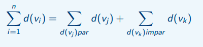

# Terminologia de Grafos

## Loop

Um grafo que possue loop significa que um grafo aponta para ele mesmo, ou seja, ele possuí caminho para si próprio gerando um loop. Podendo ser *direcionado* ou *não direcionado*

**Sua notação seria:**

(vi, vi) -> uma par direcionado em que `vi` aponta também para `vi`, ou seja, si próprio.

## Arestas Paralelas

Um grafo com arestas paralelas se trata de um grafo de aresta *direcionadas* ou *não direcionadas*, que possuem o mesmo intuito de chegada no caminho. Ou seja, se temos um par direcionado de caminhos A e B que tem possuem o mesma notação (u, v), podemos chegar no mesmo vértice seja por A ou B, portanto arestas paralelas. Em resumo, uma aresta associada ao mesmo par de vértices.

## Grafo Simples

Um grafo considerado simples, é aquele que não apresenta tanto *loop* quanto *arestas paralelas*, possuindo caminhos *direcionados* ou *não direcionados* para os demais vértices.

## Vértices Adjacentes

Consideramos dois vértices com o pressuposto de adjacente se eles possuem uma conexão de arestas entre eles, podem receber o codnome de vizinhos, sendo os pontos finais de uma mesma aresta. 

## Grau de Vértices

O conceito de grau pode ser definido como a *quantidade de arestas que incidem sobre esse vértice*, podendo se caracterizar de acordo com o tipo de grafo.

### Grafo Não Direcionados

Quando temos um grafo não-direcionado não temos direção correta a ser seguida portanto ambos os vértices devem receber a adição de um grau para eles, já há uma mesma quantidade de incidência de arestas em ambos. 

### Grafo Direcionado

Em grafos que possuem um direção específica esse quesito muda, sendo essencial analisar a incidência de entreda de arestas em um vértice e a incidência de saída de arestas desse vértices.

- **Grau de Entrada d-(v)-**: quantidade de arestas que chegam até o vértice `v`.
- **Grau de Saída d+(v)-**: quantidade de arestas que saem do vértice `v`.

### Soma de Grau

A soma de graus de um grafo sempre será igual a um valor par de acordo com o `Lema de Aperto de Mãos`, e sempre será igual duas vezes o valor de quantidade de arestas existentes.

**Sendo que:**

É um somatório de todos os valores de arestas vezes dois. Isso permite comprovar também que, a quantidade de vértices ímpares sempre será igual a uma soma par, já que, se dividirmos a soma dos graus, ambos sempre terão valor igual a par defivido ao dois (2) multiplicando no exterior da equação:

## Grafo Regular

Quando analisamos que todos os vértices de um grafo apresentam a mesma quantidade de grau, denominamos esse grafo como um grafo regular.

## Vértice Isolado

Entretanto, se algum vértice presente dentro do nosso grafo não possuir nenhuma conexão de aresta direta com outro vértide denominamos que esse é um *vértice isolado*, e seu *grau sempre será igual a zero (0)*.

## Aresta Pendente

Da mesma forma, quando possuímos um vértice que apresenta apenas uma conexão de aresta possuindo portanto seu grau igual ao valor um (1), este vértice é denominado como *vértice pendente*, até visualmente se assemelha com um pêndulo.

## Grafo Nulo

Da mesma forma, se todo o nosso grafo apresentar todos os valores de seus graus como zero (0) ele não apresentará também nenhuma conexão portanto nulo, sendo todos os seus vértices sem conexões de arestas.

## Grafo Rotulado e Valorado

Grafos também podem ser rotulados de acordo com o seu tipo, sendo esses dois mais importantes:

- Rotulados
- Valorados

### Rotulados

Grafos rotulados são aqueles que apresentam a denominação de um rótulo em específico ou na sua aresta ou em seu vértice, podendo possuir nomes, descrições, etc. Rótulos para a sua denominação.

### Valorados

Já grafos valorados também carregam valores consigo, mas neste caso apenas valores númericos.    

## Grafo Completo

Já um grafo completo pode ser definido por meio da análise de se possuir uma aresta para cada par de vértice existente, onde difine também que para qualquer vértice teremos um adjacente ou vizinho.

Este valor pode ser definido por meio de uma análise combinatória de todos os possíveis pares de vértices, como segue a notação abaixo:

| E | = (n − 1) × n / 2

**Sendo que:**

O número de arestas do grafo será igual ao número de vértices menos 1 vezes a quantidade de vértices, sendo esse um grafo não direcionado já que divimos pelo valor 2, de ida e volta de um mesmo vértice.

Se fosse uma grafo direcionado, cada aresta teria um valor único, portanto a divisão não seria necessária, sendo a nova notação como:

| E | = (n − 1) × n

## Grafo Conexo 

Definido por aquele que apresenta sempre algum caminho para passar por todos os vértices

## Grafo Bipartido

Um grafo bipartido é aqueles que o seu conjunto de vértices pode ser bipartido em dois conjuntos de v' e v'', tais que, todas aresta presente ao conjunto v' consegue alcançar as arestas de v''.

