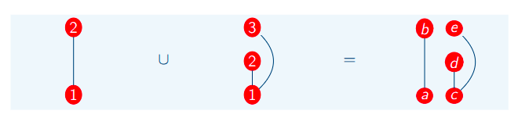
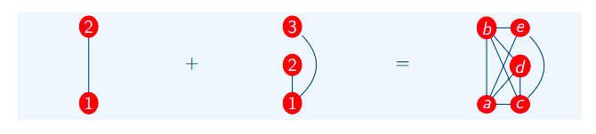

# Operações com Grafos

## Operação de União 

Define apenas a união de dois grafos, sem realizar a conexão de suas arestas. A união define que dessa forma eles vão apenas pertencer ao mesmo grafo, e não modificar suas conexões.

## Operação de Soma

Na soma é realizada a alteração de suas ligações, sendo que, todo vértice pertencendo ao grafo G' deve realizar conexões por aresta diretamente com o grafo G''.

